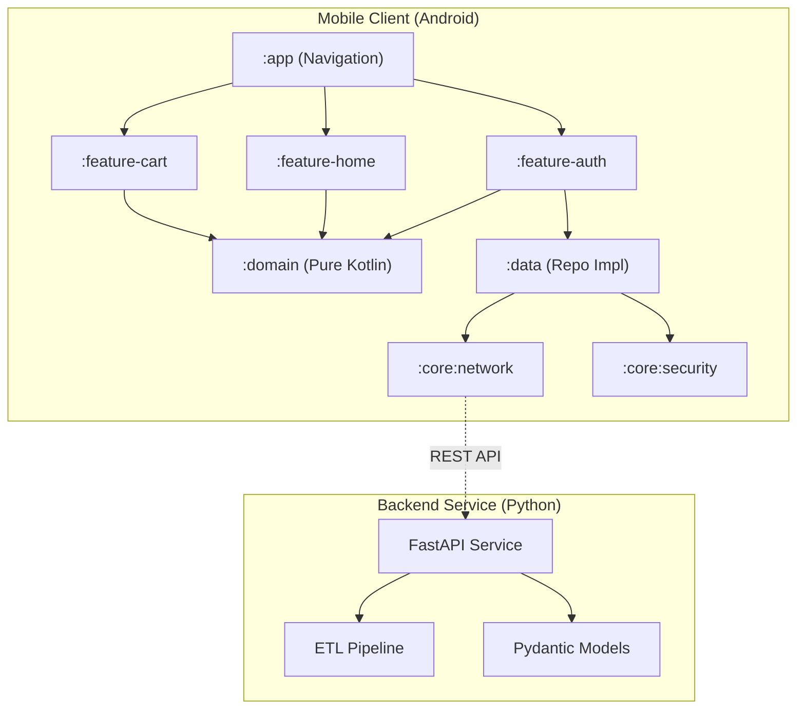

# 🛒 SmartCommerce - Enterprise Mobile & Data Ecosystem


> **"More than just an App."**  
> A complete demonstration of modern **Mobile Engineering**, **Clean Architecture**, and **Data Integration**.

---

## 🌟 Project Overview

**SmartCommerce** is a modular, scalable, and secure application ecosystem designed to demonstrate **Enterprise-Level** development capabilities. It bridges the gap between high-end Android Development and Data Engineering.

### 🎯 Key Capabilities Demonstrated
*   📱 **Modern Android Development**: Built 100% with **Jetpack Compose** and **Material 3**.
*   🏛️ **Software Architecture**: Strictly follows **Clean Architecture** (Domain/Data/UI separation) and **MVVM/MVI** patterns.
*   🔒 **Enterprise Security**: Secure token storage with **EncryptedSharedPreferences** and network hardening.
*   🐍 **Data Engineering Integration**: Includes a **Python Microservice (FastAPI)** for ETL (Extract, Transform, Load) processes and Data Validation.
*   🔄 **DevOps & Automation**: Fully automated CI/CD pipeline with **GitHub Actions** and **Docker** containerization.

---

## 🏗️ Architecture & Modules

The project uses a **Multi-Module** architecture to ensure scalability and separation of concerns.



| Module | Description | Tech Stack |
| :--- | :--- | :--- |
| **`app`** | Main entry point, Navigation Graph. | Navigation Compose |
| **`domain`** | Business Logic, Use Cases, Interfaces. | Pure Kotlin |
| **`data`** | Repository Implementations, API Calls. | Retrofit, OkHttp |
| **`feature-*`** | UI Screens and ViewModels. | Jetpack Compose, Hilt |
| **`backend`** | Data Processing Microservice. | **Python, FastAPI, Pandas** |

---

## 🛠️ Tech Stack & Tools

### 📱 Android (Client)
*   **Language**: [Kotlin](https://kotlinlang.org/) (100%)
*   **UI Toolkit**: [Jetpack Compose](https://developer.android.com/jetpack/compose)
*   **DI**: [Hilt](https://dagger.dev/hilt/) (Dependency Injection)
*   **Async**: Coroutines & Flow
*   **Validation**: Turbine & Mockk (for Testing)
*   **Image Loading**: Coil

### 🐍 Backend (Data Service)
*   **Framework**: [FastAPI](https://fastapi.tiangolo.com/) (High-performance API)
*   **Validation**: [Pydantic](https://docs.pydantic.dev/) (Data validation)
*   **Data Processing**: [Pandas](https://pandas.pydata.org/) (ETL Simulation)
*   **Deployment**: [Docker](https://www.docker.com/) (Containerization)

---

## 🚀 Getting Started

Follow these steps to set up the entire ecosystem on your local machine.

### 1️⃣ Android App Setup
```bash
# Clone the repository
git clone https://github.com/damlalper/smartcom-app.git

# Open in Android Studio (Koala+ recommended)
# Sync Gradle and Run 'app' configuration
```

### 2️⃣ Python Backend Setup
You can run the backend locally or via Docker.

**Option A: Local Python**
```bash
cd backend
pip install -r requirements.txt
uvicorn main:app --reload
# Server running at http://127.0.0.1:8000
```

**Option B: Docker (Recommended)**
```bash
docker build -t smartcommerce-backend .
docker run -p 8000:8000 smartcommerce-backend
```

---

## 🚦 Feature Showcase

### 🔐 Authentication & Security
*   Secure Login Flow with Token Management.
*   **Tech**: `EncryptedSharedPreferences`, AES-256 Encryption.

### 🛍️ E-Commerce Flows
*   **Product Discovery**: Optimized lists with `LazyColumn` and caching.
*   **Cart Management**: State-heavy UI managed by **MVI (Model-View-Intent)** with Unidirectional Data Flow.

### � Data Intelligence (New!)
*   **Risk Analysis API**: Simulates an efficient ETL pipeline for energy sector risk assessment.
    *   **Input**: JSON Data (Region, Consumption)
    *   **Process**: Pandas Transformation
    *   **Output**: Risk Score & Classification

---

## 🧪 Testing & Quality Assurance

We maintain high code quality through automated checks.

*   **Unit Tests**: Domain & ViewModel layers.
*   **CI/CD**: GitHub Actions pipeline runs on every push.

```bash
# Run Android Unit Tests
./gradlew testDebugUnitTest
```

---

## 📂 Documentation Links

*   [🔐 Security Policy](SECURITY.md)
*   [🤖 CI/CD Pipeline](CI_CD.md)

---
**Author**: Damla Alper  
**License**: MIT